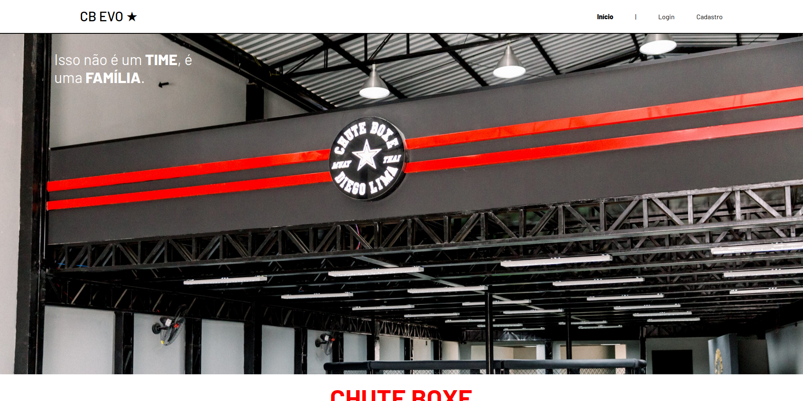

    O CB Evo é um projeto de registro e acompanhamento de treinos de artes marciais,
criada para permitir o acompanhamento pessoal e incentivar a prática de ativvidades
físicas com o foco no Muay Thai. O projeto auxilia os praticantes para que registrem seus
treinos, acompanhem sua evolução ao longo do tempo e compartilhem sua jornada com a
comunidade.

    A plataforma oferece dashboards individuais com linha do tempo de treinos,
gráficos de acompanhamento, mural com os gráficos de todos os atletas e indicadores
gerais como distribuição de treinos por esporte, gênero dos usuários e participação por
academia.

Contatos: caua.martos@sptech.school	

Instagram: @caua.martos
